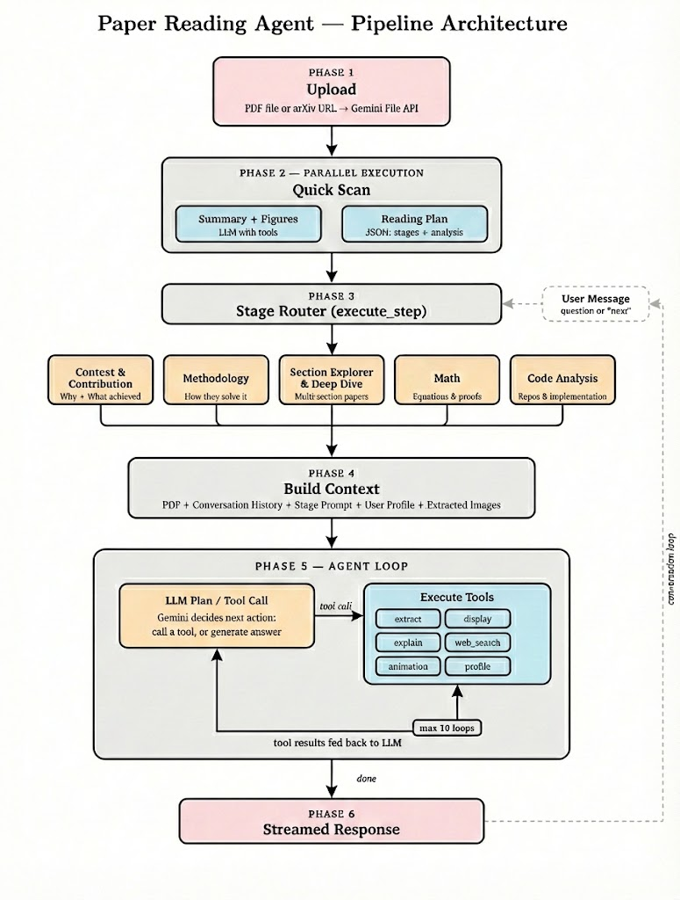

# Paper Reading Agent

An AI-powered research paper reading assistant that helps you understand, analyze, and discuss academic papers.

## Features

- **Smart Summaries** - Get instant, intelligent summaries of research papers
- **Interactive Q&A** - Ask questions about the paper and get detailed, context-aware answers
- **Multi-Language Support** - Supports English and Chinese for summaries and discussions
- **ArXiv Integration** - Paste any ArXiv link and we'll automatically fetch the PDF
- **Figure Analysis** - AI extracts and explains figures, charts, and equations
- **Reading History** - Keep track of all your papers and conversations

## System Architecture



The Paper Reading Agent follows a sophisticated 6-phase pipeline designed for deep comprehension and interactive analysis of academic papers:

1.  **Phase 1: Upload** - PDFs or ArXiv URLs are uploaded and processed through the Gemini File API, allowing the model to handle long-context documents efficiently.
2.  **Phase 2: Quick Scan** - Parallel execution of summary generation, figure extraction, and the creation of a structured **Reading Plan** (JSON).
3.  **Phase 3: Stage Router** - Dynamically routes the conversation through specialized stages:
    *   **Context & Contribution**: High-level motivation and results.
    *   **Methodology**: Detailed technical approach.
    *   **Section Explorer & Deep Dive**: Multi-section navigation.
    *   **Math**: Formula and proof analysis.
    *   **Code Analysis**: Implementation details.
4.  **Phase 4: Build Context** - Aggregates the PDF content, conversation history, stage-specific prompts, user profiles, and extracted images to provide a rich context for the LLM.
5.  **Phase 5: Agent Loop** - An iterative "Plan-Execute-Observe" loop where Gemini uses tools (extract, display, web_search, etc.) to refine its understanding. Supports up to 10 iterations.
6.  **Phase 6: Streamed Response** - Delivers real-time answers to the user via Server-Sent Events (SSE).

## Tech Stack

| Layer | Technology |
|-------|------------|
| Frontend | React 18, TypeScript, styled-components |
| Backend | Flask (Python) |
| Database | SQLite |
| AI | Google Gemini API |

## Quick Start

### Prerequisites

- Python 3.12+
- Node.js 18+
- Google Gemini API key ([Get one here](https://aistudio.google.com/app/apikey))

### Installation

1. **Clone the repository**
   ```bash
   git clone <repository-url>
   cd paper-reading-agent
   ```

2. **Backend Setup**

   ```bash
   cd backend

   # Create virtual environment
   python3 -m venv venv
   source venv/bin/activate  # Windows: venv\Scripts\activate

   # Install dependencies
   pip install -r requirements.txt

   # Create .env file
   echo "GOOGLE_API_KEY=your-api-key-here" > .env

   # Run the server
   python app.py
   ```

   Backend runs at http://localhost:5000

3. **Frontend Setup**

   ```bash
   cd frontend

   # Install dependencies
   npm install

   # Run development server
   npm start
   ```

   Frontend runs at http://localhost:3000

## Project Structure

```
.
├── backend/
│   ├── app.py              # Flask API server
│   ├── database.py         # SQLite database operations
│   ├── models/             # SQLAlchemy models
│   ├── agents/             # AI agent logic
│   │   ├── agent.py        # Conversational agent & Stage Router
│   │   ├── stage_prompts/  # Specialized stage instructions
│   │   ├── prompts.py      # Base LLM system prompts
│   │   ├── tools.py        # Agent tool definitions
│   │   └── image_extractor.py
│   ├── providers/          # AI providers (Gemini)
│   └── uploads/            # Local storage for PDFs and figures
│
├── frontend/
│   ├── src/
│   │   ├── App.tsx         # Main application component
│   │   ├── App.css         # Styles
│   │   ├── components/     # React components
│   │   └── types.ts        # TypeScript types
│   └── package.json
│
└── README.md
```

## API Endpoints

| Endpoint | Method | Description |
|----------|--------|-------------|
| `/api/analyze` | POST | Upload and analyze a PDF |
| `/api/chat` | POST | Send a message about a paper |
| `/api/papers` | GET | List all papers |
| `/api/papers/<id>/messages` | GET | Get chat history |
| `/api/papers/<id>` | DELETE | Delete a paper |
| `/uploads/<path>` | GET | Serve uploaded files |
| `/health` | GET | Health check |

## Environment Variables

Create `backend/.env` with:

```env
GOOGLE_API_KEY=your-gemini-api-key
```

## Usage

1. Open http://localhost:3000 in your browser
2. Click "Upload Your Paper" or the + button
3. Upload a PDF file or paste an ArXiv URL
4. Select your preferred output language
5. Click "Analyze and Add"
6. Once analyzed, ask questions about the paper in the chat

## Development

### Using UV (Recommended)

```bash
cd backend

# Install uv
curl -LsSf https://astral.sh/uv/install.sh | sh

# Install dependencies
uv sync

# Run server
uv run python app.py
```

### Running Tests

```bash
# Frontend
cd frontend
npm test

# Backend
cd backend
python -m pytest
```

## License

MIT License - see LICENSE file for details.

## Acknowledgments

- [Google Gemini](https://ai.google.dev/) for AI capabilities
- [Flask](https://flask.palletsprojects.com/) for the backend framework
- [React](https://react.dev/) for the frontend framework
